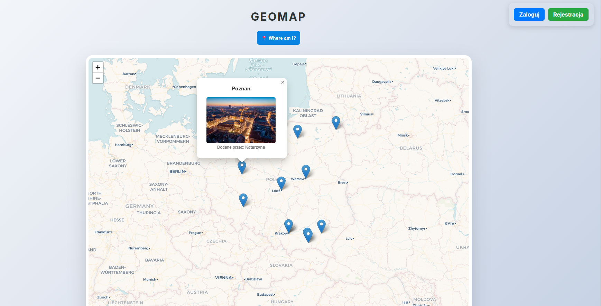

# 📸 GeoSnap – Mapping Your Memories

**GeoSnap** is a full-stack web application designed to help users geotag their photos and visualize them on a beautiful, interactive map. Built with **Django**, **GeoDjango**, and **Leaflet.js**, it combines the power of spatial databases with a modern user interface.

---

## 🚀 Features

* **Interactive Map:** Explore uploaded photos via a responsive Leaflet.js map.
* **Geotagged Uploads:** Users can upload photos with precise GPS coordinates.
* **Smart Permissions:**
    * Users can only delete their own photos.
    * Administrators (Staff) have full control to manage all content.
* **Spatial Database:** Powered by **PostGIS** for high-performance geographic queries.
* **Mobile Ready:** Fully accessible via mobile browsers (tested with ngrok).
* **Dockerized:** Simple local setup using Docker and Docker Compose.

---
## 📸 Preview



---

## 🛠 Tech Stack

**Backend:**
* **Python / Django** (GeoDjango)
* **Django REST Framework (DRF)** & **DRF-GIS**
* **Gunicorn** (Production server)

**Frontend:**
* **Leaflet.js** (Maps & Markers)
* **JavaScript (ES6+)**
* **HTML5 / CSS3**

**Database & DevOps:**
* **PostgreSQL** with **PostGIS** extension
* **Docker** & **Docker Compose**
* **Render** (Cloud Deployment)

---

## 💻 Local Setup (Development)

To get this project running on your local machine using Docker:

1.  **Clone the repository:**
    ```bash
    git clone [https://github.com/YourUsername/geosnap.git](https://github.com/YourUsername/geosnap.git)
    cd geosnap
    ```

2.  **Spin up the containers:**
    ```bash
    docker-compose up --build
    ```

3.  **Run Migrations:**
    ```bash
    docker-compose exec web python manage.py migrate
    ```

4.  **Create a Superuser:**
    ```bash
    docker-compose exec web python manage.py createsuperuser
    ```

5.  **Access the app:**
    Open [http://localhost:8000](http://localhost:8000) in your browser.

---

## 🌐 Deployment on Render

This project is configured for easy deployment on **Render.com**.

1.  Create a **PostgreSQL** instance on Render and enable the **PostGIS** extension.
2.  Connect your GitHub repository to a **Render Web Service**.
3.  Set the **Runtime** to **Docker**.
4.  Add the following **Environment Variables**:
    * `DATABASE_URL`: Your PostgreSQL internal connection string.
    * `ALLOWED_HOSTS`: `geosnap.onrender.com`
    * `SECRET_KEY`: A long, random production secret key.

---

## 📝 License

Distributed under the MIT License. See `LICENSE` for more information.
